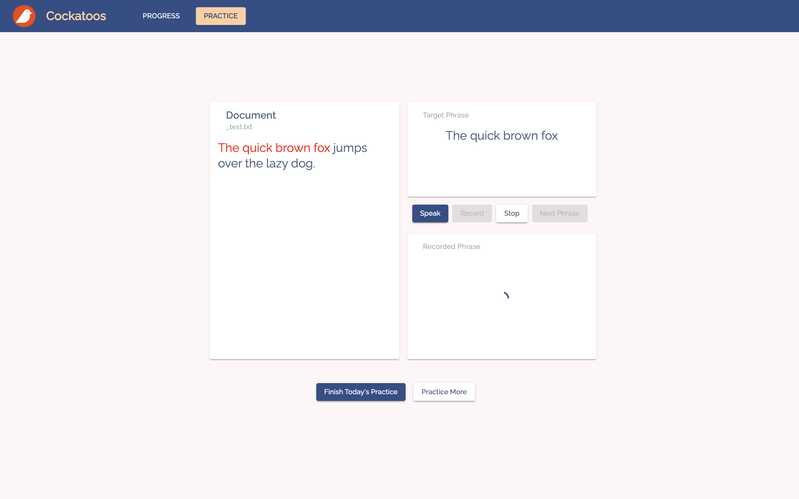
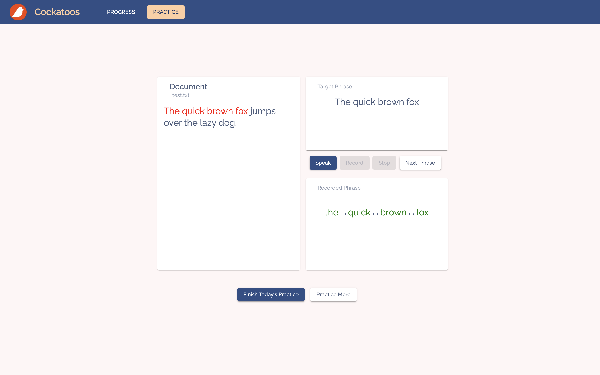
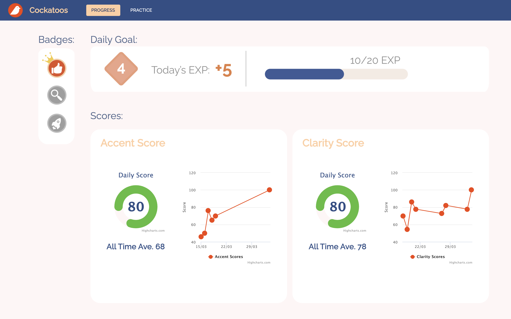
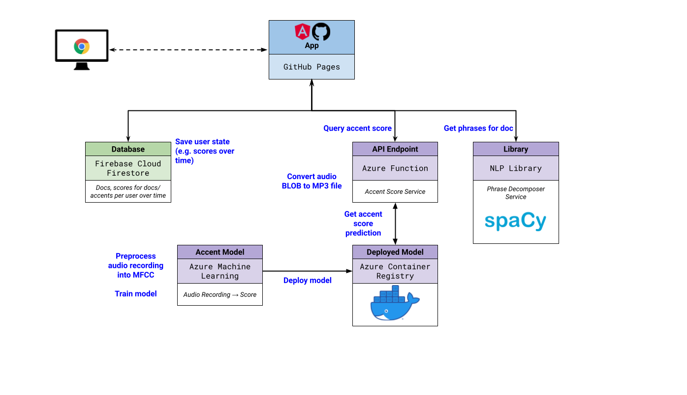

<a name="top"></a>

# :owl: Cockatoos App [](https://github.com/cockatoos/cockatoos-app/actions/workflows/lint.yml) [](https://github.com/cockatoos/cockatoos-app/actions/workflows/test.yml) [](https://github.com/cockatoos/cockatoos-app/actions/workflows/deploy.yml)

> ## _Making speech training more accessible_

1. <a href="#intro">Introducing Cockatoos</a>
    * <a href="#vision">Our Vision</a>
    * <a href="#in-action">Cockatoos In Action</a>
        * <a href="#practice">Practice</a>
        * <a href="#feedback">Feedback and Progress Tracking</a>
2. <a href="#architecture">Architecture</a>
    * <a href="#spacy">Sentence Phrasing</a>
    * <a href="#model">Scoring Model</a>
        * <a href="#accent-score">Accent Score</a>
        * <a href="#clarity-score">Clarity Score</a>
2. <a href="#challenges">Challenges</a>
3. <a href="#accomplishments">Accomplishments</a>
5. <a href="#future">Future Extensions</a>
6. <a href="#getting-started">Getting Started</a>

## 💻 See also

Repo | Description
---|---
[cockatoos/accent_scoring](https://github.com/cockatoos/accent_scoring) | Accent scoring using Azure AI
[cockatoos/azure-function-accent-scoring](https://github.com/cockatoos/azure-function-accent-scoring) | Middleware to interface between Azure AI model and client application
[cockatoos/phrase-chunker](https://github.com/cockatoos/phrase-chunker) | NLP utility to break down article into suitable-size phrases

---
---

# <a name="intro"></a> 1️⃣ Introducing Cockatoos

> _Cockatoos_ provides an intuitive accent training platform that empowers language learners to improve their speaking using the Echo Method.

## <a name="vision"></a> 🔮 Our Vision

Like many non-native English speakers, some of our team members struggle with certain English pronunciation.
There is no existing platform that allows English learners to practice their speaking by providing feedback on how understandable they sound and pointing out the nuances in their pronunciation.
Furthermore, hiring a speech coach for speech training can easily cost up to £200 per hour <sup>[<a href="#cite-accent">1</a>]</sup>. 

Our team built _Cockatoos_ with a goal to make speech training easier and more accessible.
_Cockatoos_ is an intuitive speech training platform powered by an NLP model that provides an easy way for language learners to practice their speaking.
It also provides instant feedback on users pronunciation and articulation, and allows the users to track their progress over time.

## <a name="in-action"></a> 🎬 _Cockatoos_ In Action

### 👉 <a name="practice"></a> Practice

_Cockatoos_ provides an interface for users to practice their speaking using the Echo Method.
Specifically, the user will firstly listen to a recording of a phrase, and then try to mimic that recording as closely as they can.

> We leverage the built-in Web Speech API to implement this workflow
> natively on the user's web browser:
>
> * `SpeechSynthesizer` - text-to-speech, generates the recording that
> the user listens to;
> * `SpeechRecognition` - speech-to-text, generates the transcript based
> on the user's speech recording;
> * `MediaRecorder` - records the user's speech



We then compared the user's speech to the original text, and highlight any misunderstood or missing words.
Afterwards, the user moves on to the next phrase by pressing next, and they'll keep repeating this cycle until they're done with this article. If they want to continue practising, they can press "Practice More" to retrieve a new article from the database.



Once they finish practicing, the user can go back to the progress dashboard to check their daily scores.

### 👉 <A name="feedback"></a> Feedback and Progress Tracking

After the user finishes practicing,
we calculate the articulation and pronunciation  scores(as mentioned in the <a href="#model">Scoring Model</a> section).
The users can see their daily scores, as well as historical trends, on the progress dashboard. 

The clarity score is calculated from a word-level comparison between the original text from the articles, and the text generated from the user's recordings.
Using the _Levenshtein distance_, we award a score out of 100 based on the differences in text, with 100 being an exact match in words, and 0 being a complete mismatch. 

The pronunciation score is calculated by our model adapted from the paper _Deep Learning Approach to Accent Classification_<sup>[<a href="#cite-paper">2</a>]</sup>. Since this problem is a bit more abstract, our approach was to use machine learning to compare the user's delivery to that of a native speaker. We chose to draw a comparison to the Standard American accent, since it had the most data and resources to support our model.



<p align="center">
<a href="#top">🔝</a> 
</p>

---

# <a name="architecture"></a> 2️⃣ Architecture



## <a name="spacy"></a> 🔧 Sentence Phrasing

The practice articles must be broken into readable and logical phrases to make it easier for users to read.

We built a phrasing tool utilising the SpaCy NLP (Natural Language Processing) API to divide long sentences into smaller chunks while being aware of punctuation, parts of speech, and word dependencies. 

## <a name="model"></a> 🔧 Scoring Model

_Cockatoos_ evaluates vocal delivery on two main components:
***articulation*** and ***pronunciation***.

### 👉 <a name="accent-score"></a> Accent Score

_Cockatoos_ implements an accent scoring system for users who wish to learn more native-like rhythm in speech.
We implement this feature by constructing our own model using ***Azure ML***.

Using approximately 10,000 of Mozilla Common Voice data<sup>[<a href="#cite-mozilla">3</a>]</sup>, we chopped the audio file into 1-second segments. Then we filtered out segments with low volumes to avoid using void sound files. The chopped audiofiles are then converted into MFCCs. MFCCs describe frequency level based on *human ear perception* rather than the raw frequency, which enable us to implement a CNN model to distinguish accents. 

![Difference between general frequency format (left) of audiofile and MFCC frequency format (right). Image from [2]](./media/mfcc.png)

_Difference between general frequency format (left) of audiofile and MFCC frequency format (right). <sup>[<a href="#cite-paper">2</a>]</sup>_

We built the following model based on this work<sup>[<a href="#cite-paper">2</a>]</sup>:

```python
  (0): Conv2d(3, 32, kernel_size=(3, 3), stride=(1, 1))
  (1): ReLU()
  (2): BatchNorm2d(32, eps=1e-05, momentum=0.1, affine=True, track_running_stats=True)
  (3): MaxPool2d(kernel_size=2, stride=2, padding=0, dilation=1, ceil_mode=False)
  (4): Conv2d(32, 64, kernel_size=(3, 3), stride=(1, 1))
  (5): ReLU()
  (6): BatchNorm2d(64, eps=1e-05, momentum=0.1, affine=True, track_running_stats=True)
  (7): MaxPool2d(kernel_size=2, stride=2, padding=0, dilation=1, ceil_mode=False)
  (8): Dropout(p=0.5, inplace=False)
  (9): Flatten(start_dim=1, end_dim=3)
  (10): Linear(in_features=6336, out_features=256, bias=True)
  (11): Dropout(p=0.5, inplace=False)
  (12): Linear(in_features=256, out_features=1, bias=True)
  (13): Sigmoid()
```

Using 10-fold cross validation, we trained the model to achieve 65-75% testing accuracy on detecting native British/American depending on different sets of data. 

_Cockatoos_ provides the user with accent score by preprocessing the user recordings into 1-second segmented MFCC file and forwarding it to this model.
The model outputs the probability in which each segment is the accent of a native English speaker, then outputs the average of this possibility as the score.

We utilised _Azure ML_ to make the acces of the large scale data (12GB) easy among our teammates.
Then we trained our model by submitting experiments to AzureML, and stored and deployed trained model to the Azure regitstered model.
This model is used in Azure Function that collects the user input, pre-process and forward feed it to return the accent score results to UI.

### 👉 <a name="clarity-score"></a> Clarity Score

The clarity score represents how clearly the user's English speaking is perceived by a native English speaker.
_Cockatoos_ approximates this behaviour by measuring how accurately the user has pronounced the words in the given article, using the Speech Recognition API available in the standard Web Speech API.

We observe that naive phrase comparison techniques (such as counting how many spoken words appear in the ground truth text) fail to accurately measure the user's performance, as these techniques do not consider the whole context of the target phrase that the user is reciting.

The clarity score is computed based on a *case-insensitive, punctuation-agnostic word-level Levenshtein distance*.

> The Levenshtein distance is a common algorithm used for spell-checking to determine similarities between words based on the minimum number of *character-*level edits to transform the observed word into the ground truth word — the edits could either be a (character) insertion, deletion, or replacement.

We adapt this to compute the minimum edits on a *word* level to transform the recognised speech into the ground truth target phrase.
We also keep track of 'no-op' edits, which carry zero weight in the Levenshtein distance, but contribute to the edit count.
Thus, the clarity score is the number of no-op edits divided by the number of total edits.

<p align="center">
<a href="#top">🔝</a> 
</p>

---

# <a name="challenges"></a> 3️⃣ Challenges

## ⚠️ Azure ML

Working with AzureML had a steep learning curve. It always seemed like an easier way to run training on my own laptop rather than establishing a pipeline through Azure. Having to establish our own docker settings for our packages was another challenge. 

However, after we've established our pipeline, collaborating became so much easier as none of us have to download data or run training overnight on our laptops. This improved my sleeping quality as I was suffering from helicopter sounds from my laptop everynight.

## NLP Model

The main issue faced with regard to the pre-processing was the chunking of the audio files.
The ideal scenario is to split each audio file into its constituent words and perform analysis on those.
However, an efficient out of the box solution was not available leading to different approaches needing to be tested in order to get the desired data.

The data being used consisted of a variety of different speakers saying a range of different phrases which made model convergence more difficult compared to the work this was based on where a smaller number of speakers were saying a set number of clearly spoken words.

Data management also required careful consideration due to the large number of files as the audio was chunked and the different datasets that were experimented on.
There was a large imbalance in the number of original data files with the majority being for American accents, so analysis had to be done on the corresponding meta data file to split the data into well balanced portions.
The standardised MFCC data was stored in large batches across a smaller number of files to ensure that the time taken to load the data was minimal.

## ⚠️ Architecture

Some preprocessing libraries require a Linux package that cannot be installed in the default container provided by Azure Function.
We decided to use a Docker container to host our function.
However, we ran into a CORS error when testing the HTTP triggers locally.
We found that CORS cannot be enabled for local development, as the Docker image ignores the local.settings.json file that can be used for such configuration.
A similar issue has been discussed on GitHub [(Azure/azure-functions-host#50590)](https://github.com/Azure/azure-functions-host/issues/5090).

As a result, we had to test our implementation by pushing the Docker image, and interact with the deployed function. This slowed down our development and debugging process.

## ⚠️ Synchronising Web Speech API with MediaRecorder

Our frontend application is required to perform speech recognition
and capture the audio recording as an audio blob simultaneously.
Because the Speech Recognition API does not expose the audio blob, the latter could not be achieved solely via the Web Speech API.

We addressed this by delegating the audio recording responsibility to the MediaRecorder API, also built into the browser. We implmeented an Angular service with `start/stop` APIs that act as a fascade to the Speech Recognition API and MediaRecorder, and synchronises the operations invoked on the two web APIs accordingly.

<p align="center">
<a href="#top">🔝</a> 
</p>

---

# <a name="accomplishments"></a> 4️⃣ Accomplishments

<p align="center">
<a href="#top">🔝</a> 
</p>

---

# <a name="future"></a> 5️⃣ Future Extensions


1. Save and categorise misspoken phrases
2. Give advice on how to pronunce the phrase more accurately
3. Use a more sophisticated speech to text API so users can have a wider selection of target accents

<p align="center">
<a href="#top">🔝</a> 
</p>

---

# <a name="getting-started"></a> 6️⃣ Getting Started

This project was generated with [Angular CLI](https://github.com/angular/angular-cli) version 11.2.2.

## Prerequisites

* `nodejs`
* `npm`

```bash
$ cd /path/to/cockatoos-app

# Install dependencies
$ npm i
```

## Development server

```bash
$ cd /path/to/cockatoos-app
$ npm start

# Navigate to http://localhost:4200/.
# The app will automatically reload if you change any of the source files.
```

## Testing with Storybook

Run `npm run storybook` to test the component in an isolated environment. An storybook example can be found in score-chart folder.

## Fixing linting errors

```bash
$ cd /path/to/cockatoos-app

# Identify linting errors
$ npm run lint

# Attempt to fix
$ npm run fix
```

## Running unit tests

```bash
$ cd /path/to/cockatoos-app
$ npm test
```

## Further help

To get more help on the Angular CLI use `ng help` or go check out the [Angular CLI Overview and Command Reference](https://angular.io/cli) page.

<p align="center">
<a href="#top">🔝</a> 
</p>

---
---

<a name="cite-accent"></a> <sup>[1]</sup> Accent Reduction & Softening Classes in London | London Speech Workshop. https://www.londonspeechworkshop.com/our-courses/accent-softening/

<a name="cite-paper"></a> <sup>[2]</sup> Sheng, Leon Mak An, and Mok Wei Xiong Edmund. <a href="http://cs229.stanford.edu/proj2017/final-reports/5244230.pdf">"Deep Learning Approach to Accent Classification."</a> <em>Project Report, Stanford University, Stanford, CA</em> (2017).

<a name="cite-mozilla"></a> <sup>[3]</sup> Common Voice. Mozilla. https://commonvoice.mozilla.org/en
