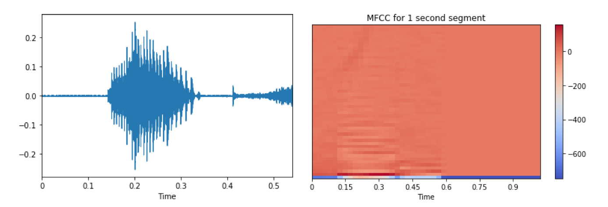

<a name="top"></a>

# :owl: Cockatoos App [](https://github.com/cockatoos/cockatoos-app/actions/workflows/lint.yml) [](https://github.com/cockatoos/cockatoos-app/actions/workflows/test.yml) [](https://github.com/cockatoos/cockatoos-app/actions/workflows/deploy.yml)

> ## _Making speech training more accessible_

1. <a href="#intro">Introducing Cockatoos</a>
    * Our Vision
    * Cockatoos In Action
        * Practice
        * Feedback and Progress Tracking
2. <a href="#architecture">Architecture</a>
    * Sentence Phrasing
    * Scoring Model
        * Accent Score
        * Clarity Score
2. <a href="#challenges">Challenges</a>
3. <a href="#accomplishments">Accomplishments</a>
5. <a href="#future">Future Extensions</a>
6. <a href="#getting-started">Getting Started</a>

---
---

# <a name="intro"></a> 1️⃣ Introducing Cockatoos

> ## _Cockatoos_ provides an intuitive accent training platform that empowers language learners to improve their speaking using the Echo Method.

## 🔮 Our Vision

Like many non-native English speakers, some of our team members struggle with certain English pronunciation.
There is no existing platform that allows English learners to practice their speaking by providing feedback on how understandable they sound and pointing out the nuances in their pronunciation.
Furthermore, hiring a speech coach for speech training can easily cost up to £200 per hour <sup>[<a href="#cite-accent">1</a>]</sup>. 

Our team built _Cockatoos_ with a goal to make speech training easier and more accessible.
_Cockatoos_ is an intuitive speech training platform powered by an NLP model that provides an easy way for language learners to practice their speaking.
It also provides instant feedback on users pronunciation and articulation, and allows the users to track their progress over time.

## 🎬 _Cockatoos_ In Action

### 👉 Practice

_Cockatoos_ provides an interface for users to practice their speaking using the Echo Method.
Specifically, the user will firstly listen to a recording of a phrase, and then try to mimic that recording as closely as they can.

> We leverage the built-in Web Speech API to implement this workflow
> natively on the user's web browser:
>
> * `SpeechSynthesizer` - text-to-speech, generates the recording that
> the user listens to;
> * `SpeechRecognition` - speech-to-text, generates the transcript based
> on the user's speech recording;
> * `MediaRecorder` - records the user's speech


We then compared the user's speech to the original text, and highlight any misunderstood or missing words.
Afterwards, the user moves on to the next phrase by pressing next, and they'll keep repeating this cycle until they're done with this article. If they want to continue practising, they can press "Practice More" to retrieve a new article from the database.


Once they finish practicing, the user can go back to the progress dashboard to check their daily scores.

### 👉 Feedback and Progress Tracking


<p align="center">
<a href="#top">🔝</a> 
</p>

---

# <a name="architecture"></a> 2️⃣ Architecture

## 🔧 Sentence Phrasing

The practice articles must be broken into readable and logical phrases to make it easier for users to read.

We built a phrasing tool utilising the SpaCy NLP (Natural Language Processing) API to divide long sentences into smaller chunks while being aware of punctuation, parts of speech, and word dependencies. 

## 🔧 Scoring Model

Cockatoos evaluates vocal delivery on two main components:
***articulation*** and ***pronunciation***.

### 👉 Accent Score



### 👉 Clarity Score

The clarity score represents how clearly the user's English speaking is perceived by a native English speaker.
_Cockatoos_ approximates this behaviour by measuring how accurately the user has pronounced the words in the given article, using the Speech Recognition API available in the standard Web Speech API.

We observe that naive phrase comparison techniques (such as counting how many spoken words appear in the ground truth text) fail to accurately measure the user's performance, as these techniques do not consider the whole context of the target phrase that the user is reciting.

The clarity score is computed based on a *case-insensitive, punctuation-agnostic word-level Levenshtein distance*.

> The Levenshtein distance is a common algorithm used for spell-checking to determine similarities between words based on the minimum number of *character-*level edits to transform the observed word into the ground truth word — the edits could either be a (character) insertion, deletion, or replacement.

We adapt this to compute the minimum edits on a *word* level to transform the recognised speech into the ground truth target phrase.
We also keep track of 'no-op' edits, which carry zero weight in the Levenshtein distance, but contribute to the edit count.
Thus, the clarity score is the number of no-op edits divided by the number of total edits.

<p align="center">
<a href="#top">🔝</a> 
</p>

---

# <a name="challenges"></a> 3️⃣ Challenges

<p align="center">
<a href="#top">🔝</a> 
</p>

---

# <a name="accomplishments"></a> 4️⃣ Accomplishments

<p align="center">
<a href="#top">🔝</a> 
</p>

---

# <a name="future"></a> 5️⃣ Future Extensions


<p align="center">
<a href="#top">🔝</a> 
</p>

---

# <a name="getting-started"></a> 6️⃣ Getting Started

This project was generated with [Angular CLI](https://github.com/angular/angular-cli) version 11.2.2.

## Prerequisites

* `nodejs`
* `npm`

```bash
$ cd /path/to/cockatoos-app

# Install dependencies
$ npm i
```

## Development server

```bash
$ cd /path/to/cockatoos-app
$ npm start

# Navigate to http://localhost:4200/.
# The app will automatically reload if you change any of the source files.
```

## Testing with Storybook

Run `npm run storybook` to test the component in an isolated environment. An storybook example can be found in score-chart folder.

## Fixing linting errors

```bash
$ cd /path/to/cockatoos-app

# Identify linting errors
$ npm run lint

# Attempt to fix
$ npm run fix
```

## Running unit tests

```bash
$ cd /path/to/cockatoos-app
$ npm test
```

## Further help

To get more help on the Angular CLI use `ng help` or go check out the [Angular CLI Overview and Command Reference](https://angular.io/cli) page.

<p align="center">
<a href="#top">🔝</a> 
</p>

---
---

<a name="cite-accent"></a> <sup>[1]</sup> Accent Reduction & Softening Classes in London | London Speech Workshop. https://www.londonspeechworkshop.com/our-courses/accent-softening/

<a name="cite-paper"></a> <sup>[2]</sup> Sheng, Leon Mak An, and Mok Wei Xiong Edmund. <a href="http://cs229.stanford.edu/proj2017/final-reports/5244230.pdf">"Deep Learning Approach to Accent Classification."</a> <em>Project Report, Stanford University, Stanford, CA</em> (2017).


<sup>[3]</sup>